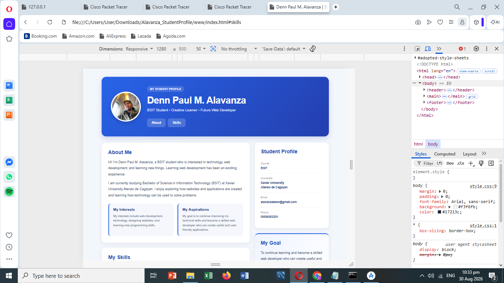
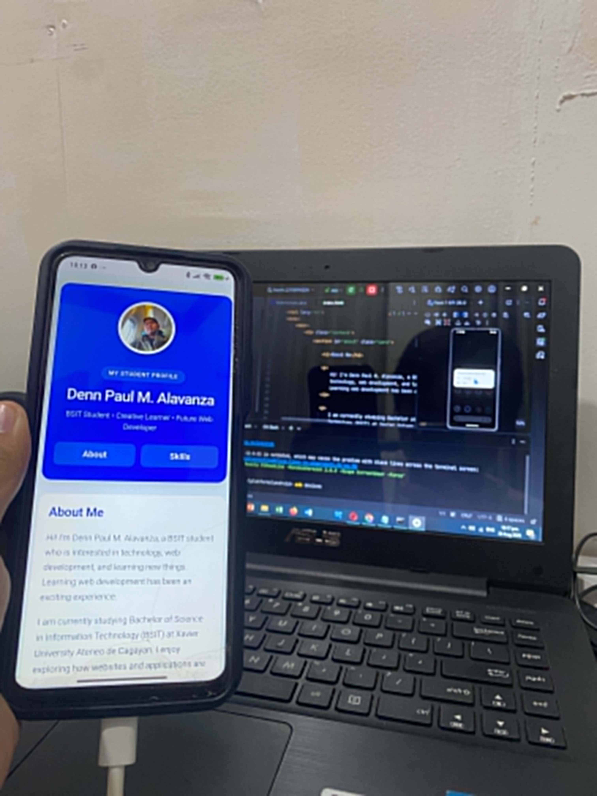
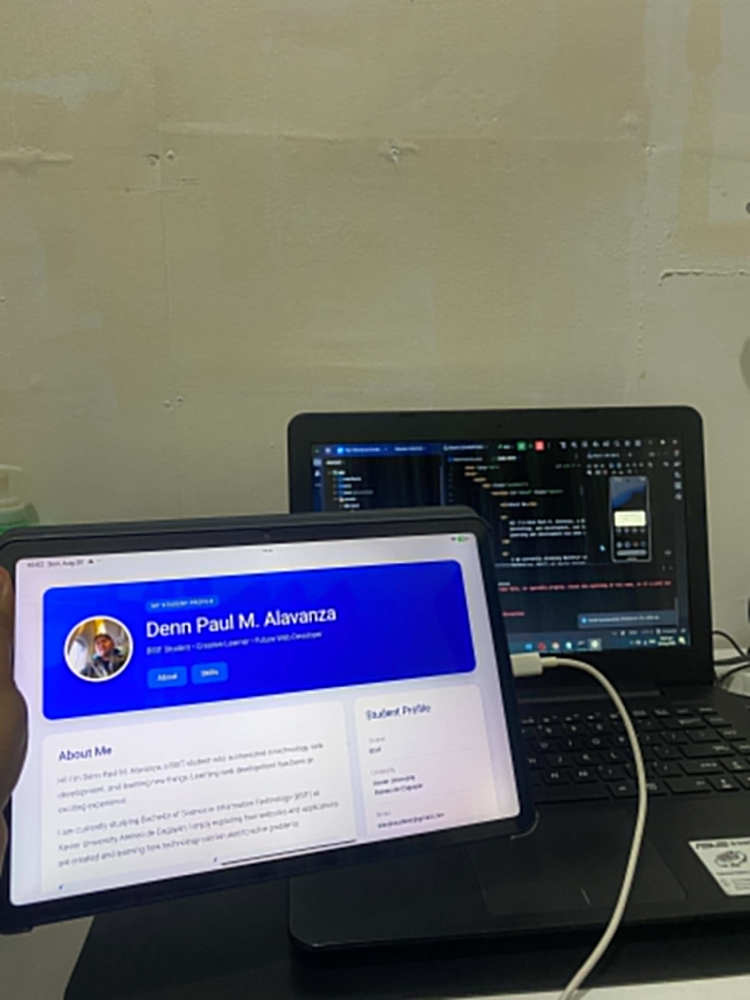

# Alavanza Student Profile

## 1. Project Description

A responsive Student Profile application created using HTML and CSS. It presents my personal information, educational background, interests, goals, and skills.

I am currently studying Bachelor of Science in Information Technology (BSIT) at Xavier University Ateneo de Cagayan. Learning web development has been an exciting experience.

## 2. Application Structure

- **Header** – Contains my profile picture, name, subtitle, and navigation.
- **Navigation** – Contains About and Skills links.
- **About Section** – Contains information about myself, interests, education, and goals.
- **Skills Section** – Contains five skills with short descriptions.
- **Footer** – Contains the copyright notice, name, and current year.

## 3. Responsive Design

The application uses CSS Flexbox, CSS Grid, and media queries to adapt the layout for desktop, tablet, and mobile screens. Spacing, typography, images, and content automatically adjust to keep the application readable and organized.

## 4. UI/UX Principles Applied

- **Responsive Layout** – Adapts to different screen sizes.
- **Mobile-Friendly Spacing** – Uses proper margins, padding, and gaps.
- **Appropriate Typography** – Uses clear and readable font sizes.
- **Clear Visual Hierarchy** – Organizes headings, name, skills, and information clearly.
- **Usable Controls** – Navigation links have sufficient size and spacing.
- **Basic Accessibility** – Includes readable text, image alt text, clear headings, and good contrast.
- **Consistent Design** – Uses consistent colors, typography, spacing, and card styles.

## 5. Navigation

The **About** and **Skills** links use HTML anchor links (`#about` and `#skills`) to navigate to their corresponding sections within the same page. JavaScript is not used for navigation or responsive behavior.

## 6. How to Run

### Browser

Open `index.html` in a web browser.

### Cordova

```text
cd Downloads\Alavanza_StudentProfile
cordova build android
cordova run android


## 7. Application Screenshots

### Desktop Layout



### Mobile Layout



### Tablet Layout


